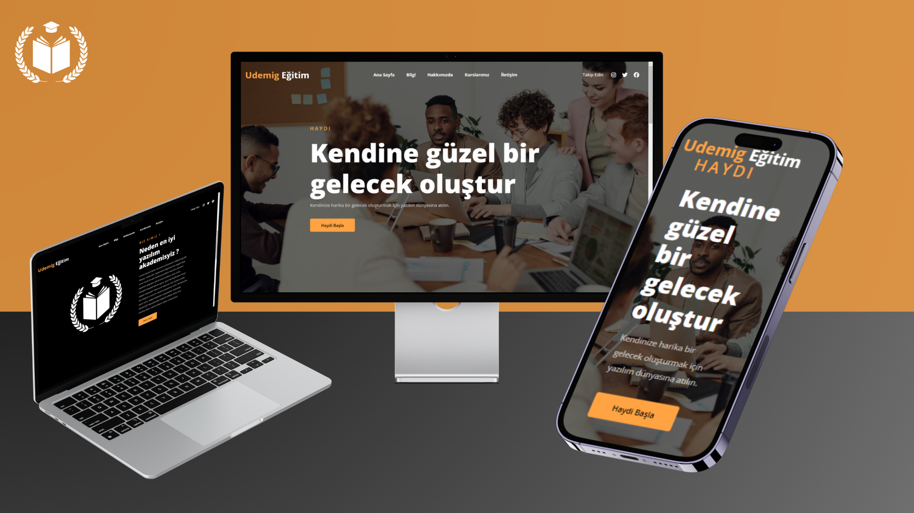

## Eğitim Sitesi

**Başlık:** Udemig

**Açıklama:** Bu web sitesi, frontend dersi için hazırlanmış bir proje ödevinden oluşmaktadır.

Tek sayfadan oluşan bu web sitesi, turuncu ve siyah renkleri kullanılarak tasarlanmıştır. Bu renk paleti, dinamik ve çarpıcı bir atmosfer oluşturmayı amaçlamaktadır.

**Logo:**

    

**Genel Görsel:**

**Temel Bilgiler:**

* **Tasarım:** Sitemiz responsive bir tasarıma sahip ve tek sayfadan oluşuyor.
* **Renk Paleti:** turuncu ve siyah renkleri kullanılarak tasarlanmıştır.
* **Kullanılan Teknolojiler:**
    * HTML
    * CSS

**Sayfalar:**

## Ana Sayfa

## Hakkımızda

## Kurslar

## Footer

* **Kullanılan Teknolojiler:**
    * HTML
    * CSS
    * JavaScript

**Ek Özellikler:**

## Hover
 
 
 
 

# Responsive
 

# Renkler

